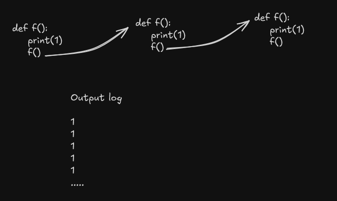
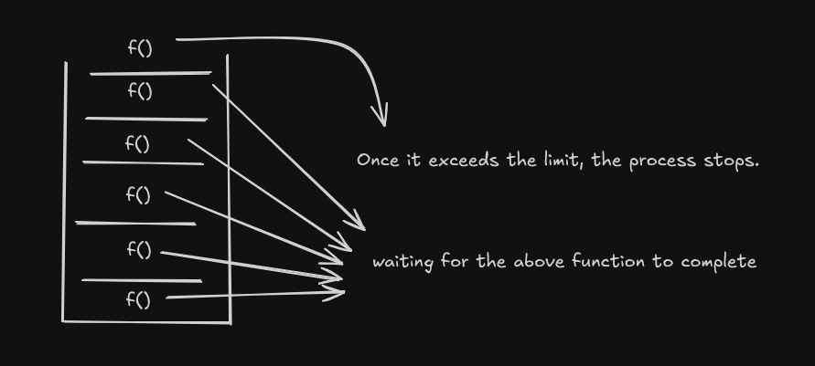
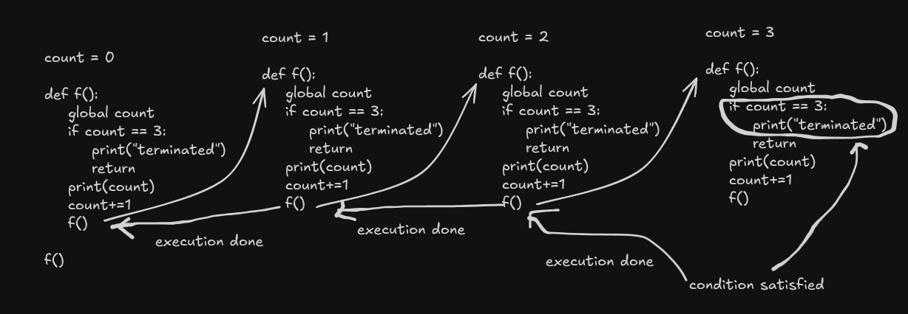
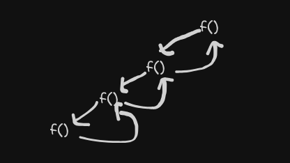

# Recursion

When a function calls itself until,
a specified condition is met.

## Example
```python
def f():
    print(1)
    f()

f()
```
In the above code when f() is executed it would look like this:



- Because we have not provided any condition to stop it is going on infinitely. 
- In reality the system will run out of memory and we get a error statement and code terminates there. This also called stack overflow.
- That is why the second line of recursion is very important that is providing a stop condition.

## What is stack overflow?

Taking the above example, code execution is as follows

1. 1 is printed
2. As f() has been called it is added to the call stack.



and this continues till the maximum limit of the stack is reached, after which the process exits. This happens because each function is waiting for the latest function call of f() to be completed. 
This is called stack overflow.

## Base condition

The condition when met stops the recursion from continuing or the stopping condition for the recursion.

Example :

```python
count = 0

def f():
    global count
    if count == 3:
        print("terminated")
        return
    print(count)
    count+=1
    f()

f()
```

Here the if condition acts as a base condition. There can be multiple base conditions. In the above case it is only one.

The stack trace would look something like the image below.



## Recursion Tree

If we want to trace the way code is executed it would look something like the above image.

But we can have a much more simplified way of representing the stack. In this representation we are only writing the function name and show how the execution happened. This is also called recursion tree.



The above image is the recursion tree for the base condition example.
